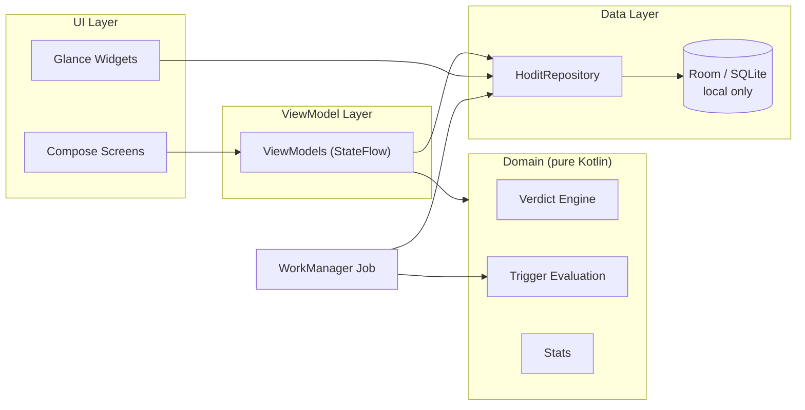

# HODIT — How Often Does That Happen

A local-only Android app for checking gut feelings against reality.

<!-- Badges: add once CI and Play Store listing are live -->

---

## The idea

Sometimes a thought hits you: *"this always happens"* — or *"this never happens anymore."* Usually you don't actually know. HODIT lets you check.

Open a **Case** on the thing you've noticed — a teenager snapping at you, a migraine, the train running late, the coffee coming out perfect, a friend calling out of the blue. Log occurrences as they happen. State a **Hunch** about how often you *feel* it happens, and once there's enough data, get the **Verdict**: fact, or just a feeling.

---

<!-- TODO: screenshots — one per theme (Serious / Goth / Quirky) -->

---

## What it does

- **Log in one tap.** A home-screen widget records "it happened, now" without opening the app. Optionally add detail: intensity, duration (including live start/stop for ongoing things like a rough day), notes, and tags. Logging something you only remembered later works too.
- **Hunches and verdicts.** Tell the app "I feel this happens daily" and it will eventually answer with the observed rate. It waits for enough data first — with a handful of logs it says "early days" rather than pretending to know.
- **The Big Picture.** Every Case on one shared timeline, occurrences as dots aligned by date. When your "unbearable day" dots stack above your "kiddo was rude" dots, you can see it — the app draws, you conclude.
- **Per-case visuals and stats.** A dot timeline showing bursts and droughts, a year-in-pixels calendar, a day-of-week × time-of-day rhythm heatmap, gaps, trends, durations, intensity.
- **Triggers.** A factual heads-up when something happens 3+ times in a week, or hasn't happened in 14 days. A count and a name — the rest is up to you.
- **Three themes, three voices.** Serious, Goth, and Quirky change the colors *and* every word the app says. The goth verdict for a disproven fear: *"Your dread was exaggerated."*
- **Share the reveal.** Turn a Case into a story-style card — the case, the hunch, the evidence, the verdict — styled by your theme, sized for stories or feeds. You preview first, can rename the case on the card, and notes/tags never leave the phone.
- **Your data stays yours.** Everything lives on the phone; the app doesn't even request network permission. Export/import as JSON anytime.

## By design, it leaves out

No streaks, scores, or reminders to "do better" — many Cases are about things nobody controls, and an event *not* happening is information, not failure. No accounts, no cloud, no analytics, no ads.

## Tech stack

| Layer | Technology |
|---|---|
| Language | Kotlin |
| UI | Jetpack Compose + Material 3 |
| Architecture | MVVM — ViewModel + StateFlow |
| Widgets | Jetpack Glance (list widget + single-case widget) |
| Storage | Room (SQLite) — local only, no cloud sync |
| Background | WorkManager (trigger evaluation) |
| DI | Hilt |
| Navigation | Navigation Compose |
| Settings | DataStore Preferences |
| Serialisation | Moshi (export/import) |
| Min SDK | API 31 (Android 12) |

## Architecture

MVVM throughout. `HoditRepository` is the single source of truth over Room. The verdict engine, trigger evaluation, and stats live in a pure-Kotlin `domain/` layer with no Android dependencies — time comes in via an injected `Clock` — so the app's riskiest logic is fully unit-testable on the JVM. The Glance widgets and the WorkManager trigger job read the repository directly, independent of the activity lifecycle.

## Documentation

| File | Purpose |
|---|---|
| [`docs/HODIT_SPEC.md`](docs/HODIT_SPEC.md) | Full product spec — principles, data model, screens, future work |
| [`docs/TESTING.md`](docs/TESTING.md) | Test strategy, coverage, deferrals |
| [`docs/DEV_PLAYBOOK.md`](docs/DEV_PLAYBOOK.md) | Cleanup checklist, ship checklist, tooling reference |
| [`docs/CLEANUP_LOG.md`](docs/CLEANUP_LOG.md) | Timestamped record of every cleanup pass |
| [`CLAUDE.md`](CLAUDE.md) | AI collaboration rules, checked into the repo |

## AI-assisted development workflow

Every feature is defined in `HODIT_SPEC.md` before any code is written; the AI implements from the spec. Product decisions, UX direction, and architectural choices are made by the human product owner. Every branch is reviewed and approved before merging, structured cleanup passes run after each feature (logged in `CLEANUP_LOG.md`), and quality is held by a documented test strategy: JVM-first unit testing of the domain layer, instrumented Room/Compose tests, and a manual test plan for flows that cross system boundaries.

---

© 2026 SecondMonday Studios. All rights reserved.
